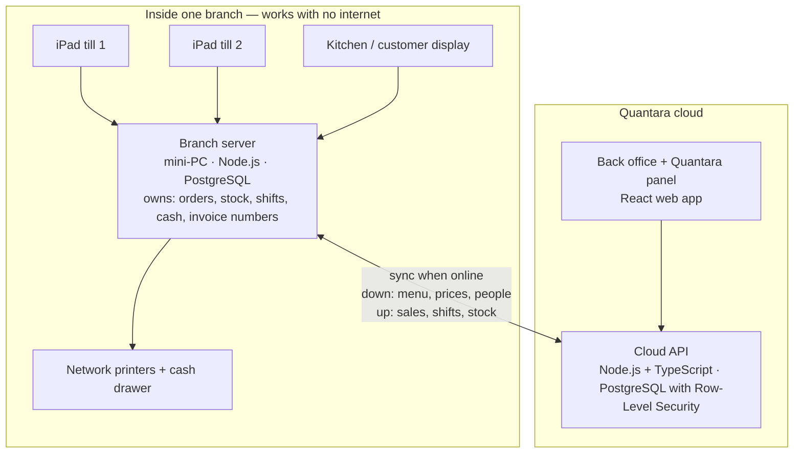

# Start here — infrastructure and plan

One page for the developer: what we build, how the system is laid out, what is decided and what is still yours to decide, and the plan week by week. Every statement links to its source. Read time: about 15 minutes.

## 1. What we are building
- **Quantara** — a point-of-sale service for cafés and restaurants, sold to many businesses (tenants). Structure: tenant → branch → register.
- **First tenant:** Electro Café, one branch. **Go-live: Tue 10 Nov 2026.**
- **Three screens for three kinds of user:** the cashier app (on an iPad), the tenant back office (head office and branch), and the Quantara panel (our own staff).
- **The hard requirement:** a branch must sell, print and close its day with **no internet**, for hours or days, and lose nothing.

## 2. The system in one picture

**Read it as:** tills talk only to the branch server. The branch server talks to the cloud when it can. Nothing inside the branch needs the internet.

## 3. Infrastructure — what is decided, proposed and open

### The three tiers
| Tier | Runs on | Technology | Is the authority for | Status |
|---|---|---|---|---|
| **Till** | iPad | Web app (React + TypeScript) served by the branch server, opened from the Home Screen | Nothing. Each order line is saved on the branch server as it is entered | **Proposed** — [ADR-002](docs/05-architecture/adr/ADR-002-ipad-till-and-offline-branch.md). The iPad is decided (D-37); the technology is yours to accept |
| **Branch server** | One mini-PC per branch (N100-class, 16 GB, SSD), Debian, Docker Compose, on a UPS | Node.js + Fastify, PostgreSQL, WebSocket to tills, ESC/POS printing, sync worker | The branch's day: orders, stock, shifts, cash, **invoice numbers** | Decided — [ADR-001](docs/05-architecture/adr/ADR-001-offline-first-multi-tenant.md) |
| **Cloud** | Hosted server | Node.js + TypeScript API, PostgreSQL with Row-Level Security, Redis + BullMQ, S3-compatible storage | The tenant: menu, prices, people, permissions, settings; reports across branches | Decided — ADR-001. **Hosting provider open** |

### Around the tiers
| Topic | Where we stand | Status |
|---|---|---|
| Code repository | Not this repo. This repo (`PosD`) holds specifications only. One code repo with packages for cloud API, branch server, till web app and shared schema | **Open — you name it** (Q-05) |
| Environments | Local (Docker Compose) · staging · production | Staging this week on any single server; production by Sprint 4 |
| Hosting provider | Must be allowed to serve a Syrian customer, reachable from the café's line without a VPN, with managed PostgreSQL and point-in-time restore | **Open — you choose** (Q-06). Shortlist two and test from Damascus |
| Deploys | Automatic to staging on merge; production by manual approval. Secrets only in the CI secret store | To set up in POSD-97 |
| Backups | Cloud: daily plus point-in-time, one real restore test before go-live. Branch: nightly local backup; synced events are the off-site copy | To design |
| Monitoring | Uptime check, error tracking, alert when a branch has not synced for N hours | Sprint 5 |
| Network in the branch | One access point and one switch on the UPS; branch server and printers on cable; iPads on Wi-Fi | Proposed — ADR-002 |
| HTTPS in the branch | An installed web app on iPad needs a trusted certificate even on a local network. Recommended: a name per branch server with a normal certificate renewed through the cloud, resolved locally | **Open — you choose** (ADR-002) |
| Invites and messages | Email for back-office invites; no SMS at launch (show the invite link once instead) | **Open — you confirm** (Q-07) |
| Tenant isolation | Shared schema + `tenant_id` on every row + Row-Level Security; `tenant_id` comes from the token | Decided — ADR-001 |

### Sync rules that never bend
- **One owner per table.** Menu, prices, people and settings are owned by the cloud and are read-only at the branch. Sales, shifts and stock movements are owned by the branch and are append-only in the cloud.
- **Events, not replication.** An append-only event log per branch; ids are UUIDv7; the cloud accepts an event once, keyed on `(branch_id, event_uuid)`.
- **Invoice numbers are given by the branch server only**, in the same transaction as the insert. One gapless series per branch: `EC-MAIN-000001`.
- **Offline sign-in.** PIN and card hashes and the permission matrix travel down in the sync feed; the branch server checks them.
- **Versions.** The cloud accepts the current and the previous branch schema version.

Source: [ADR-001](docs/05-architecture/adr/ADR-001-offline-first-multi-tenant.md) · [ownership boundaries](docs/01-product/ownership-boundaries.md)

## 4. The plan

### To go-live
| Sprint | Dates | You build | Demo / gate |
|---|---|---|---|
| **Sprint 2** | Sun 4 – Thu 8 Oct | **Module 1 Platform core:** setup, tenants, branches, branch server, registers, people and sign-in | Thu 8 Oct: create a tenant, branch and person through the API; sign in; a refused permission |
| Sprint 3 | 11 – 15 Oct | Catalogue and sync skeleton (if not finished), then **Module 2 Sale:** order, payment, invoice, kitchen ticket | — |
| Sprint 4 | 18 – 22 Oct | **Module 3 Shift and money:** shift, drawer, cancel and refund, printing | Production environment, backups, restore test |
| Sprint 5 | 25 – 29 Oct | **Module 4 Back office** (prices, rate, reports, stock) + **Module 5 Quantara minimum** | Feature complete (Thu 29 Oct) |
| Hardening | 1 – 5 Nov | Fixes, real outage and power-cut tests | Client sign-off (Thu 5 Nov) |
| Install | 7 – 9 Nov | Hardware on site, dry run | Go / no-go (Mon 9 Nov) |
| **Go-live** | **Tue 10 Nov** | | |

- The client decided that **everything on the launch list must work on opening day** (D-21). We build in a fixed order so the least important part is what slips: [scope-nov10](docs/02-requirements/scope-nov10.md).
- A module starts only when it passes the readiness gate: [module-readiness](docs/08-delivery/module-readiness.md).

### Your first week
| Day | Work | Ticket |
|---|---|---|
| Sun 4 | Kickoff with the PO (1 hour). Project setup: repo, PostgreSQL with Row-Level Security, CI, a health endpoint on staging | [POSD-97](https://sankari-holding.atlassian.net/browse/POSD-97) |
| Mon 5 | Read and decide ADR-002; start the iPad test | [POSD-110](https://sankari-holding.atlassian.net/browse/POSD-110) |
| Mon 5 – Tue 6 | Tenants, plans, branches, branch server, registers; isolation and plan-limit tests | [POSD-98](https://sankari-holding.atlassian.net/browse/POSD-98) |
| Wed 7 – Thu 8 | People, roles, sign-in. Demo on Thursday | [POSD-99](https://sankari-holding.atlassian.net/browse/POSD-99) |

That is 4 days of work for one person. **The catalogue ([POSD-100](https://sankari-holding.atlassian.net/browse/POSD-100)) and the sync skeleton ([POSD-108](https://sankari-holding.atlassian.net/browse/POSD-108)) move to the start of Sprint 3.** Tell the PO on Tuesday if even this is too much.

Epic: [POSD-96](https://sankari-holding.atlassian.net/browse/POSD-96) · Sprint plan: [sprint-02](docs/08-delivery/sprint-02.md)

## 5. Decisions that are yours this week
You are both the developer and the tech lead, so these wait for you. Each has a recommended answer; accept it, change it or reject it.

| # | Decision | Recommended | Needed by |
|---|---|---|---|
| 1 | Till technology on iPad | Web app served by the branch server; native shell later | Tue 6 Oct |
| 2 | HTTPS inside the branch | A name per branch server with a normal certificate, resolved locally | Tue 6 Oct |
| 3 | Code repository | New private repo under a company account; one repo, four packages | Sun 4 Oct |
| 4 | Hosting provider | Shortlist two; test from the café's line; staging on any server meanwhile | Tue 6 Oct |
| 5 | Invites | Email; otherwise show the link once. SMS after go-live | Tue 6 Oct |
| 6 | A till that cannot reach the branch server | It cannot complete a sale; it shows the state and retries | Thu 8 Oct |
| 7 | Head office offline | Branch view on the branch server now; an offline queue for head-office changes after go-live | Thu 8 Oct |

Details and reasons: [ADR-002](docs/05-architecture/adr/ADR-002-ipad-till-and-offline-branch.md) · all open questions: [open-questions](docs/08-delivery/open-questions.md)

## 6. Where the truth lives
| You want to know | Open |
|---|---|
| What to build in Module 1: entities, 13 rules, API | [Module 1 handoff](docs/05-architecture/module-01-platform-core.md) |
| The steps a user takes | [FLOW-07 Platform setup](docs/03-flows/FLOW-07-platform-setup.md) · all flows in [docs/03-flows](docs/03-flows/) |
| How a screen behaves, and field names | `prototype/index.html` (back office) and `prototype/pos.html` (cashier) — clone the repo and open them in a browser; field names in `prototype/js/data.js`, `data-ops.js` |
| What data to seed | [Electro Café seed](clients/electro-cafe/seed.md) — 1 branch, 2 registers, 7 people, 18 items |
| Who may change which value | [Ownership boundaries](docs/01-product/ownership-boundaries.md) |
| What is decided | [Decision log](docs/06-decisions/decision-log.md) |
| What the product must do | [Requirements](docs/02-requirements/requirements.md) |
| Words to use, English and Arabic | [Glossary](docs/01-product/glossary.md) |
| What to work on, and when it is done | Jira project [POSD](https://sankari-holding.atlassian.net/browse/POSD) — each ticket has a "Done when" list |
| Where the whole project stands | `prototype/requirements.html` — build process, open questions, gaps |

Figma is not a source for the backend. It decides only how screens look.

## 7. How we work
- **Questions go in the Jira ticket**, not in chat, so the answer is kept.
- **A missing rule:** ask the PO. The PO adds it to the handoff the same day. Do not guess.
- **Two sources disagree:** follow the table in [CLAUDE.md](CLAUDE.md), then tell the PO.
- **A value marked "Waits for D-xx" in the prototype** is an assumption: build it as a setting, not a fixed value.
- **You change a field or an endpoint:** the handoff is updated in the same week.
- **Money** is an integer in the tenant's currency. For Electro Café that is the new Syrian pound.
- **Every screen and every message is in English and Arabic.**
- **Done means:** reviewed and merged, CI green, automated tests for the rules in the ticket, on staging, checked by the PO against the prototype.
- **Rhythm:** a 10-minute check each morning; a demo every Thursday.

## 8. Kickoff agenda (60 minutes)
1. **The product in the prototype** — 10 min
2. **The three tiers and why the branch works offline** — 10 min
3. **Module 1, rule by rule, with the prototype open** — 20 min
4. **The tickets and their "Done when" lists** — 10 min
5. **Your questions and your seven decisions** — 10 min

Before the kickoff, please read: this page, ADR-001, ADR-002 and the Module 1 handoff.
